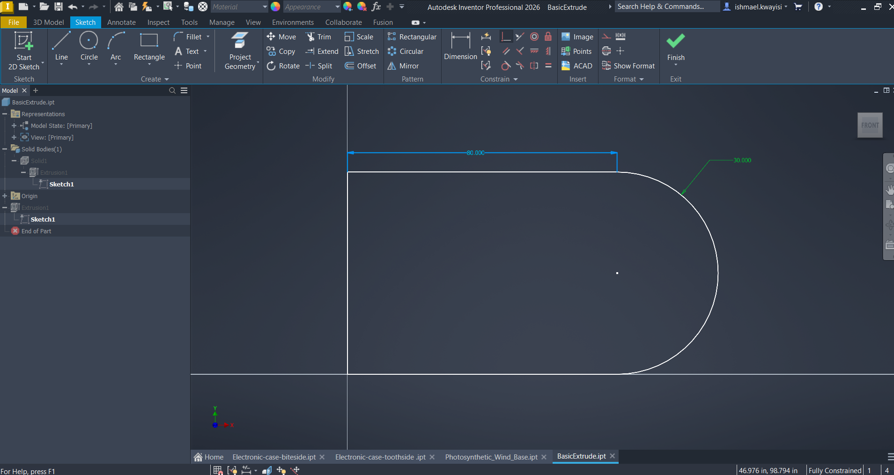

# Initial Inventor Task (Basic Extrude)

### Create a Sketch 

Here's what you want to do when to start this 3D model:

**1. Begin 2D Sketch**
- Click "start 2D Sketch"
- Use the YZ plane to start your sketch

**2. Draw Lines**
- Click on the "line" button to draw three lines:
1) One line will be starting from a point on the x-axis and heading toward the origin point.
2) The next line will go up the y-axis after starting on the origin point.
3) The last line you'll draw is going to be perpendicular to the line on the x-axis.

**3. Draw The Arc**
- After drawing the lines, click on the "arc" button.
- Connect the open end points of the perpendicular lines through the usage of the arc.

Great, the shape is connected! What's next?
Well we have the shape, but the its not fully constrained. Meaning we can't extrude or manipulate the shape as 3D object just yet... We want to prevent unpredictable geometry changes and ensure the shape is parametric (model updates based on dimensions and relationships)!

**4. Add Dimensions**
- Add a dimension to the one of the perpendicular lines by pressing the "Dimension" button and clicking on the line.
- Next, enter a value of 80 inches. This will also update the line perpendicular to it as well.
- Now we need to add a dimension to the arc. Repeat the past two steps, but this time enter 30 inches as the dimension.

Your sketch should look like this: 

Now that the dimensions of the brace have been fully constrained, lets finish the sketch!

**5. Finish The Sketch**
- This is a simple task, just hit the finish sketch button and the sketch will be complete.

Now for some more fun!

**6. Make a 3D Model Out of The Sketch**
- Press the extrude button and select the sketch in the view window.
- Upon doing this, you'll be asked the length of the extrusion, enter 10 inches.
- Click the ok button to finish the extrusion

Lastly, will just do minimal customization to the 3D object!

**7. Material Customization**
- Go to the quick access tool bar and select the drop down pertaining the "generic" material
- Select "stainless steal"
- Right click on the root file and select properties and switch to the physical tab to update the 3D mesh

Congratulations, you have completed the Basic Extrude 3D Model task!
